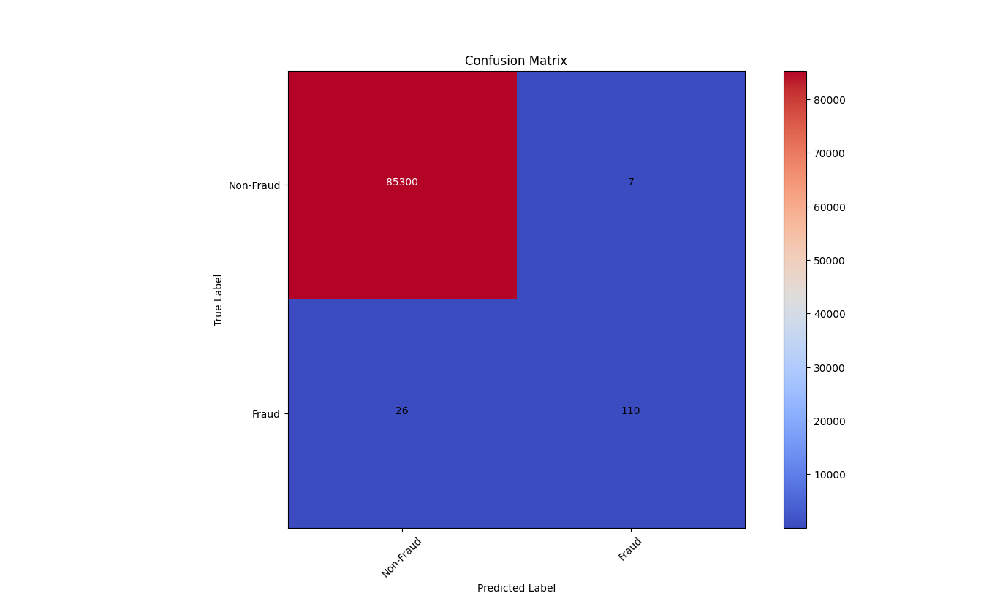
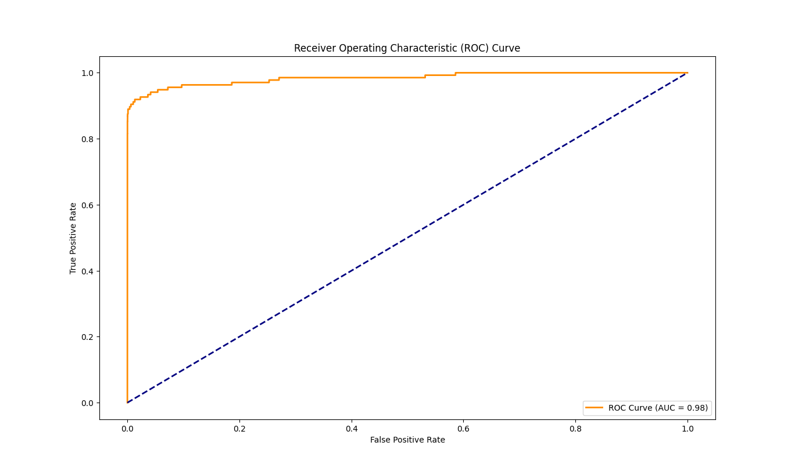
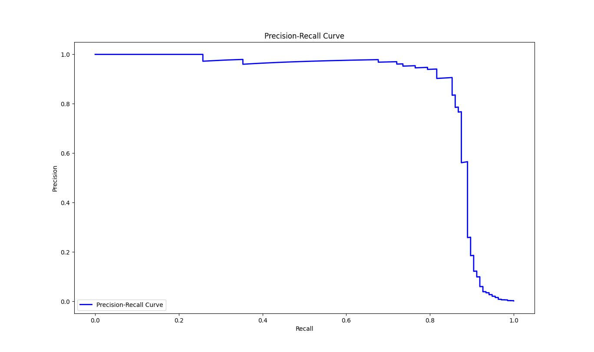

# Fraud Detection Project

This project implements a **Fraud Detection System** using machine learning techniques. It is designed to identify fraudulent transactions in a highly imbalanced dataset.

## Overview

Fraud detection is critical for financial institutions. This project:
- Uses a `RandomForestClassifier` to classify transactions as fraud or non-fraud.
- Provides clear performance evaluation with:
  - Confusion Matrix
  - ROC Curve
  - Precision-Recall Curve
- Includes visualizations for better interpretability.

---

## Visualizations

### 1. Confusion Matrix

### 2. ROC Curve

### 3. Precision-Recall Curve

---

## Project Structure

---

## Dataset

The dataset `creditcard.csv` has been removed due to GitHub file size limitations.  
You can download it from [Kaggle Credit Card Fraud Detection Dataset](https://www.kaggle.com/datasets/mlg-ulb/creditcardfraud).

---

## How to Use

### Prerequisites:
Install the necessary libraries:
pip install pandas numpy scikit-learn matplotlib

## Steps to Run:
Clone the repository:
 
git clone https://github.com/Genna-e/fraud-detection.git
cd fraud-detection
Download the dataset from Kaggle and place it in the project folder.

## Run the script:

python fraud_detection.py

## Contributions
Feel free to fork the repository, create a branch, and submit a pull request.

## License
This project is licensed under the MIT License.

## Acknowledgements
Dataset: Kaggle Credit Card Fraud Detection Dataset
Tools Used: Python, Scikit-learn, Matplotlib

## Contact
If you have any questions or feedback, feel free to reach out:

Email: youremail@example.com
GitHub: Genna-e
